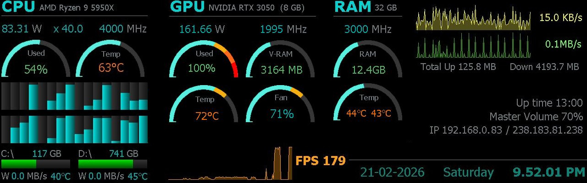
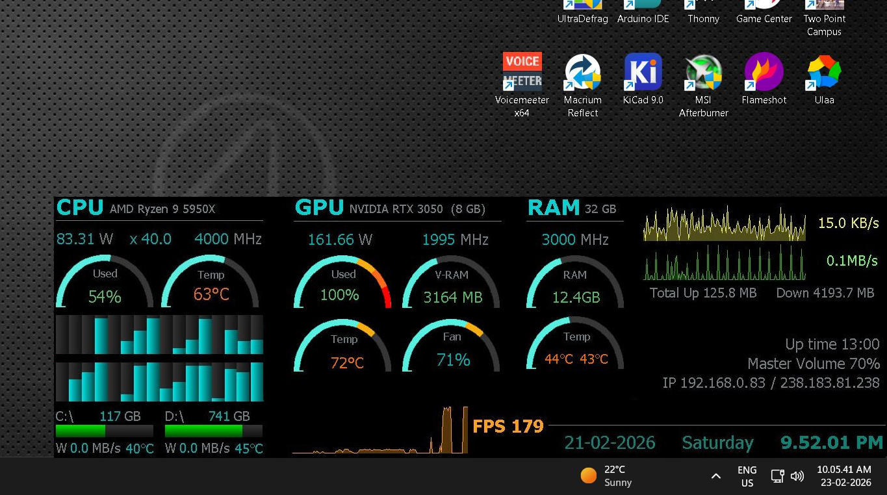
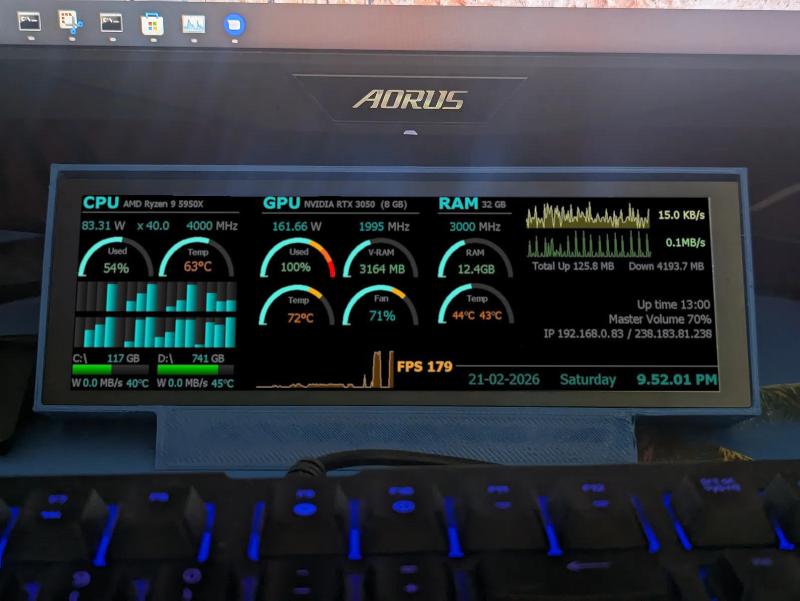
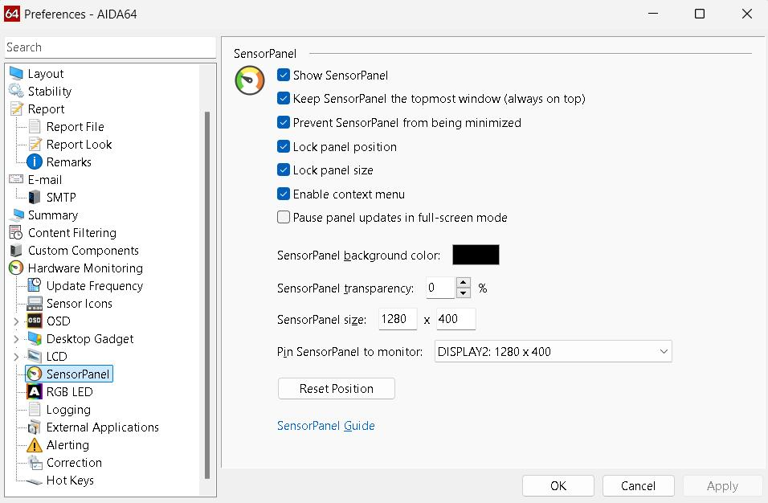

# AIDA64 1280x400 SensorPanel

A comprehensive [SensorPanel](https://www.aida64.com/user-manual/sensorpanel?language_content_entity=en) to monitor a Windows computer. The size is 1280x400 pixels, which can also be used with [Waveshare 7.9-inch HDMI LCD](https://www.waveshare.com/7.9inch-hdmi-lcd.htm) display.

It can be pinned to a normal desktop:

Alternatively, it can be used with a dedicated 1280x400 pixel mini display:

## Installation

1. Get a trial version or purchase the [AIDA64 Extreme](https://www.aida64.com/downloads) software.
2. After installing the software, [Enable and show sensor panel](https://www.aida64.com/user-manual/sensorpanel/designing-new-panel?language_content_entity=en#to-show-the-default-sensorpanel-and-start-designing). Use the following settings in preferences window:
 
3. Now you'll see a default SensorPanel. Right-click on the SensorPanel and open [SensorPanel Manager](https://www.aida64.com/user-manual/sensorpanel/sensorpanel-manager?language_content_entity=en).
4. Download and import the [1280x400.spzip](1280x400.spzip) file using the "Import" button on the top right corner of the SensorPanel manager.
5. If you are using the Waveshare 7.9-inch display, then connect it and [get the LCD screen working](https://www.waveshare.com/wiki/7.9inch_HDMI_LCD) on Windows. In the preferences window, shown above, in `Pin SensorPanel to monitor` settings, select the mini display.

You can refer to the following "Ultimate Sensor Panel Guide" for the setup and customizations:

## Files

1. [1280x400.spzip](1280x400.spzip) - Main SensorPanel file. You do not need to download other files if you plan to use the panel as it is.
2. [halfGauge](halfGauge/) - Half gauge is more succinct than the default full gauge. You can customize the half gauge by editing the [halfGauge.xcf](halfGauge/halfGauge.xcf) file in [GIMP](https://www.gimp.org/) image editor, and exporting the individual PNG files.
3. [volumeGauge](volumeGauge/) - A customized volume gauge. It has not been used in the panel, however.
